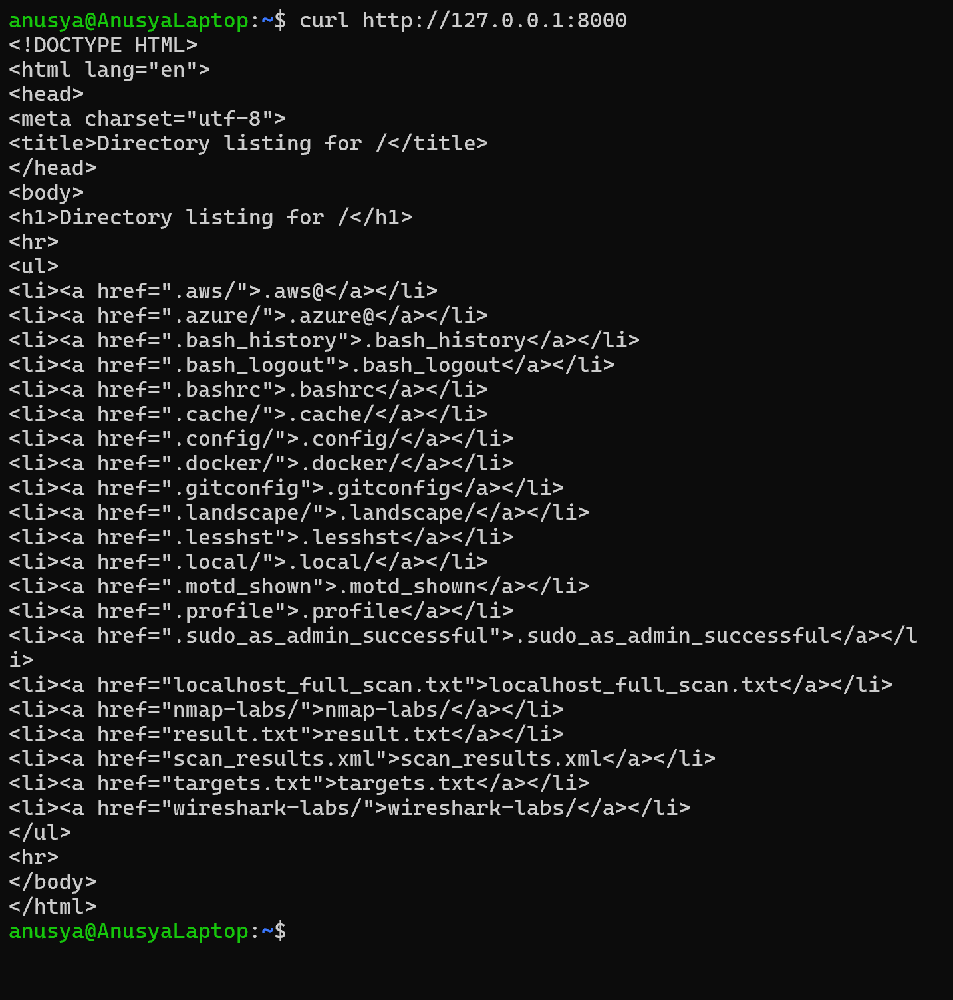
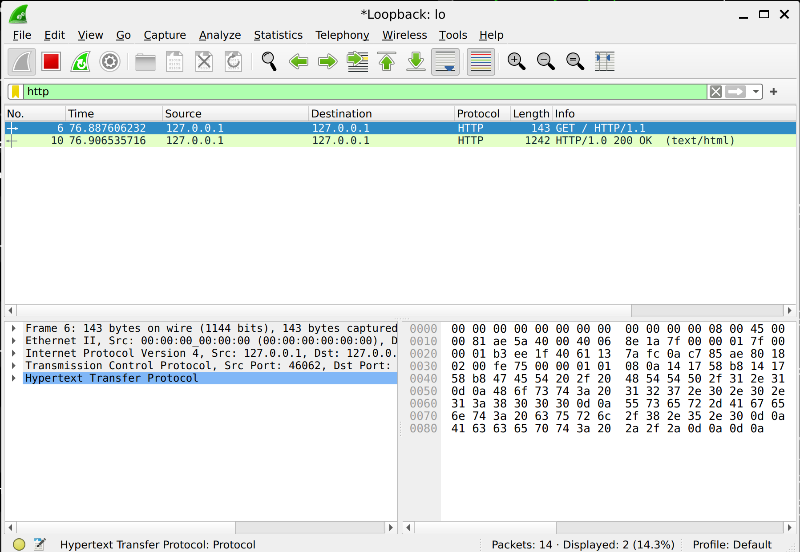

# Lab 01: Verify Wireshark Installation

## Overview

In this lab, I verified that Wireshark was installed correctly and able to capture local HTTP traffic.

The purpose of this lab was to start Wireshark, select the loopback interface, apply an HTTP display filter, generate local HTTP traffic with `curl`, and confirm that the traffic appeared in Wireshark.

This is a beginner-friendly Wireshark lab focused on basic packet capture and display filtering.

## Objective

The goal of this lab was to:

- Start Wireshark from the terminal
- Select the correct network interface
- Capture local traffic on the loopback interface
- Apply an HTTP display filter
- Generate HTTP traffic using `curl`
- Verify that HTTP packets were captured successfully

## Tools Used

- Wireshark
- Ubuntu / Linux terminal
- Python 3
- `curl`
- Loopback interface `lo`

## Scenario

Wireshark is installed on the system, but I need to confirm that it can capture traffic correctly.

Because the HTTP request is sent to `127.0.0.1`, the traffic stays inside the local machine. For this reason, the correct interface for this lab is the loopback interface:

```text
lo
```

To generate HTTP traffic, I started a local Python HTTP server on port `8000` and then sent a request to it using `curl`.

## Commands Used

### 1. Start a Local HTTP Server

In the first terminal, I started a simple HTTP server using Python 3:

```bash
python3 -m http.server 8000
```

This command starts a local web server on port `8000`.

I kept this terminal open while running Wireshark and generating HTTP traffic.

---

### 2. Start Wireshark

In another terminal, I started Wireshark using:

```bash
wireshark
```

This command opens the Wireshark graphical interface.

---

### 3. Generate Local HTTP Traffic

After starting the packet capture in Wireshark, I generated HTTP traffic using:

```bash
curl http://127.0.0.1:8000
```

This command sends an HTTP request to the local Python web server.

`127.0.0.1` is the loopback IP address, which points back to the same machine.

## Steps

### Step 1: Start the Python HTTP Server

I started a local HTTP server on port `8000`:

```bash
python3 -m http.server 8000
```

This created a simple web service that could respond to HTTP requests.

---

### Step 2: Open Wireshark

I launched Wireshark from the terminal:

```bash
wireshark
```

After Wireshark opened, I selected the loopback interface:

```text
lo
```

The `lo` interface is used for local traffic that stays inside the machine.

---

### Step 3: Start Packet Capture

After selecting the `lo` interface, I started capturing packets.

At first, Wireshark may show different types of local traffic.

---

### Step 4: Apply an HTTP Display Filter

To focus only on HTTP packets, I used the Wireshark display filter:

```wireshark
http
```

This filter shows only packets that Wireshark recognizes as HTTP traffic.

---

### Step 5: Generate HTTP Traffic with curl

In another terminal, I ran:

```bash
curl http://127.0.0.1:8000
```

The command returned an HTML directory listing from the local Python HTTP server.

This confirmed that the local HTTP server was working and that HTTP traffic was generated.

---

### Step 6: Verify HTTP Packets in Wireshark

After running the `curl` command, I checked Wireshark.

Wireshark showed HTTP packets between:

```text
127.0.0.1 → 127.0.0.1
```

The packet list included HTTP request and response traffic, such as:

```text
GET / HTTP/1.1
HTTP/1.0 200 OK
```

## Expected Result

After applying the `http` filter and generating traffic with `curl`, Wireshark should show HTTP packets.

Expected packet information:

```text
Source: 127.0.0.1
Destination: 127.0.0.1
Protocol: HTTP
Info: GET / HTTP/1.1
Info: HTTP/1.0 200 OK
```

The exact packet numbers and timestamps may be different depending on the lab environment.

## Explanation of the Result

Wireshark successfully captured local HTTP traffic.

The Python HTTP server was running on port `8000`, and the `curl` command sent an HTTP request to it:

```bash
curl http://127.0.0.1:8000
```

Because the request was sent to `127.0.0.1`, the traffic stayed inside the local machine and appeared on the loopback interface `lo`.

The `http` display filter helped isolate only HTTP packets from the captured traffic.

This confirmed that Wireshark was installed correctly and could capture and filter packets.

## Screenshots

### curl HTTP Request



### Wireshark HTTP Traffic Capture



## Key Terms

| Term | Meaning |
|---|---|
| Wireshark | A network protocol analyzer used to capture and inspect packets |
| Packet | A small unit of data sent across a network |
| Packet capture | The process of recording network packets |
| Display filter | A Wireshark filter used to show only specific packets |
| HTTP | Hypertext Transfer Protocol, used for web communication |
| `curl` | A command-line tool used to send network requests |
| Python HTTP server | A simple local web server started with Python |
| `127.0.0.1` | Loopback IP address that points to the local machine |
| `lo` | Loopback network interface used for local traffic |
| Source | The address where a packet comes from |
| Destination | The address where a packet is going |

## What I Learned

In this lab, I learned how to verify that Wireshark is installed and working correctly.

I practiced starting a local HTTP server, launching Wireshark, selecting the loopback interface, applying an HTTP display filter, and generating HTTP traffic with `curl`.

I also learned that traffic sent to `127.0.0.1` stays inside the local machine and should be captured on the loopback interface `lo`.

This lab helped me understand the basic workflow of packet capture and filtering in Wireshark.

## Security Note

This lab was performed only in a controlled local environment.

Wireshark should only be used on networks where permission is given. Capturing traffic without authorization can be illegal and unethical.

## Conclusion

This lab confirmed that Wireshark was installed correctly and able to capture HTTP traffic.

By starting a local Python HTTP server, selecting the loopback interface, applying the `http` display filter, and generating traffic with `curl http://127.0.0.1:8000`, I verified that Wireshark could capture and display local HTTP packets.
