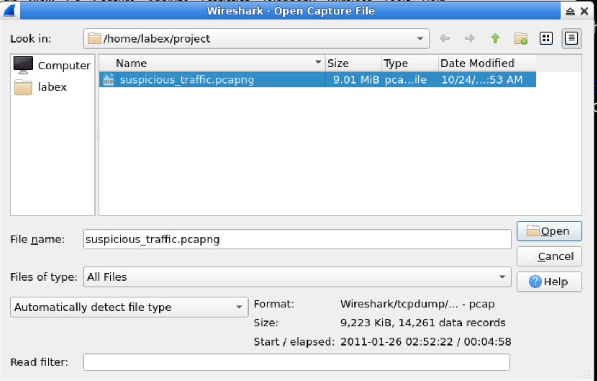
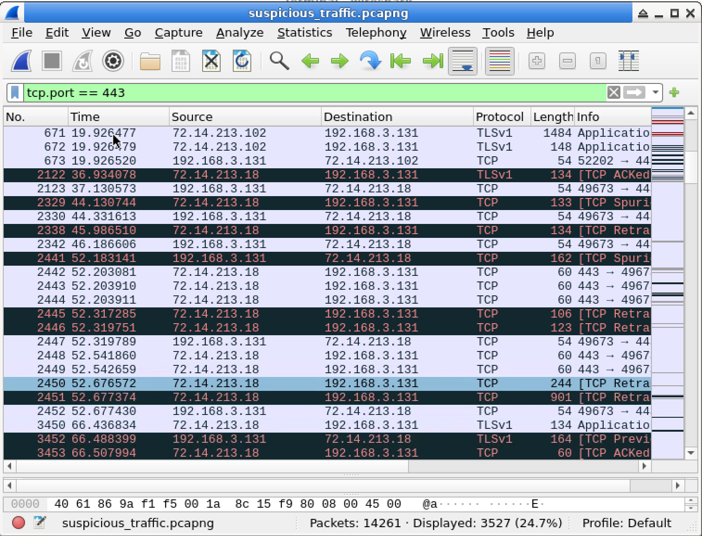
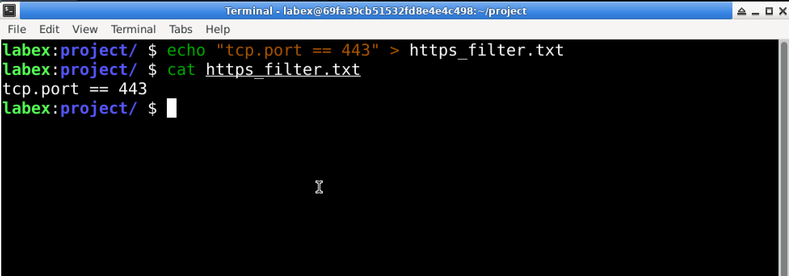

# Lab 02: Filter Encrypted Web Traffic in Wireshark

## Overview

In this lab, I used Wireshark to filter encrypted web traffic from a provided packet capture file.

The purpose of this lab was to practice using Wireshark display filters to isolate HTTPS traffic. HTTPS traffic commonly uses TCP port `443`, so I created a display filter that shows only packets related to that port.

This lab was completed in a controlled LabEx virtual machine environment.

## Objective

The goal of this lab was to:

- Open a provided packet capture file in Wireshark
- Apply a Wireshark display filter
- Isolate encrypted HTTPS traffic
- Filter traffic by TCP port `443`
- Save the filter expression to a text file
- Verify that the filter file contains the correct expression

## Tools Used

- Wireshark
- LabEx virtual machine
- Ubuntu / Linux terminal
- Provided packet capture file
- Display filter: `tcp.port == 443`

## Scenario

In this lab scenario, I acted as a junior cybersecurity analyst investigating suspicious network activity.

The security team discovered unusual network activity during off-hours and provided a packet capture file for analysis. My task was to isolate encrypted web traffic so that HTTPS communication could be reviewed more easily.

Because HTTPS commonly uses TCP port `443`, I used a Wireshark display filter based on that port.

## Lab Environment

The lab was completed inside the LabEx VM.

The provided capture file was located in:

```text
/home/labex/project/
```

The packet capture file was:

```text
suspicious_traffic.pcapng
```

For this GitHub portfolio write-up, I do not include the original `.pcapng` file. I document the process, filter used, screenshots, and what I learned.

## Commands and Filters Used

### 1. Open Wireshark

Wireshark can be started from the terminal with:

```bash
wireshark
```

Then I opened the provided capture file:

```text
suspicious_traffic.pcapng
```

---

### 2. Apply HTTPS Display Filter

To isolate encrypted HTTPS traffic, I used this Wireshark display filter:

```wireshark
tcp.port == 443
```

This filter shows packets where either the source or destination TCP port is `443`.

Port `443` is the standard port commonly used for HTTPS traffic.

---

### 3. Save the Filter Expression

The lab required saving the filter expression into a text file named:

```text
https_filter.txt
```

I created the file with this command:

```bash
echo "tcp.port == 443" > https_filter.txt
```

Then I verified the file content:

```bash
cat https_filter.txt
```

Expected output:

```text
tcp.port == 443
```

## Steps

### Step 1: Open the Provided Capture File

I opened Wireshark and loaded the file:

```text
suspicious_traffic.pcapng
```

The file was located in:

```text
/home/labex/project/
```

This capture file contained network traffic from the simulated suspicious activity.

---

### Step 2: Apply the HTTPS Filter

In the Wireshark display filter bar, I entered:

```wireshark
tcp.port == 443
```

After applying the filter, Wireshark displayed packets related to TCP port `443`.

The visible traffic included protocols such as TCP and TLS.

---

### Step 3: Verify the Filtered Traffic

After the filter was applied, the packet list showed traffic involving port `443`.

This indicated that the filter successfully isolated HTTPS-related communication from the larger packet capture.

---

### Step 4: Save the Filter to a Text File

In the LabEx terminal, I saved the filter expression to a file:

```bash
echo "tcp.port == 443" > https_filter.txt
```

Then I checked the file:

```bash
cat https_filter.txt
```

The file contained only:

```text
tcp.port == 443
```

## Expected Result

After applying the filter, Wireshark should display only packets related to TCP port `443`.

Expected packet characteristics:

```text
Port: 443
Protocols: TCP / TLS
Traffic type: Encrypted web traffic
```

The packet list may show protocols such as:

```text
TCP
TLSv1
TLSv1.2
TLSv1.3
```

The exact protocol version depends on the traffic inside the capture file.

## Explanation of the Result

HTTPS traffic is encrypted web traffic.

In many cases, HTTPS uses TCP port `443`. By applying the filter:

```wireshark
tcp.port == 443
```

Wireshark displays packets where port `443` appears as either the source port or the destination port.

This helps reduce unrelated traffic and allows an analyst to focus on encrypted web communication.

Even though HTTPS content is encrypted, Wireshark can still show useful metadata, such as:

- source IP address
- destination IP address
- source port
- destination port
- packet timing
- TLS protocol information
- amount of traffic exchanged

This information can help cybersecurity analysts investigate suspicious activity without needing to decrypt the traffic content.

## Screenshots

### Open Provided Capture File



### HTTPS Filter Result in Wireshark



### Saved Filter Expression



## Key Terms

| Term | Meaning |
|---|---|
| Wireshark | A network protocol analyzer used to capture and inspect packets |
| Packet capture | A saved file containing recorded network packets |
| PCAP / PCAPNG | File formats used to store captured network traffic |
| Display filter | A Wireshark filter used to show only selected packets |
| HTTPS | Secure version of HTTP that uses encryption |
| TCP | Transmission Control Protocol, a connection-based network protocol |
| Port 443 | Standard port commonly used for HTTPS traffic |
| TLS | Transport Layer Security, a protocol used to encrypt web traffic |
| Encrypted traffic | Network traffic where the content is protected and not readable in plain text |
| Metadata | Information about traffic, such as IP addresses, ports, and timing |

## What I Learned

In this lab, I learned how to use Wireshark display filters to isolate encrypted web traffic.

I practiced filtering packets by TCP port number and learned that HTTPS traffic is commonly associated with TCP port `443`.

I also learned that even when traffic is encrypted, Wireshark can still show useful metadata such as IP addresses, ports, protocols, timing, and TLS-related information.

This lab helped me understand how cybersecurity analysts can focus on relevant traffic during an investigation by filtering out unrelated packets.

## Security Note

This lab was completed in a controlled LabEx educational environment.

Packet captures should only be opened, captured, or analyzed when permission is given. Capturing or inspecting network traffic without authorization can be illegal and unethical.

## Conclusion

This lab helped me practice filtering encrypted web traffic in Wireshark.

By applying the display filter `tcp.port == 443`, I was able to isolate HTTPS-related traffic from a provided packet capture file and save the filter expression for verification.
