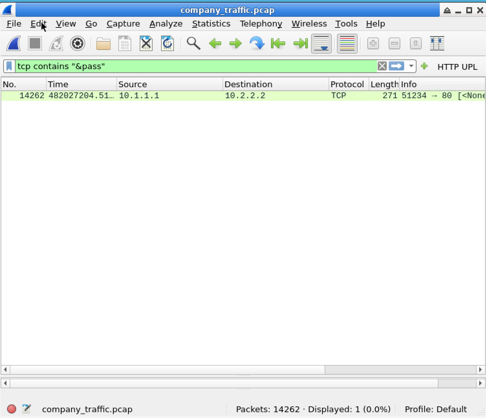
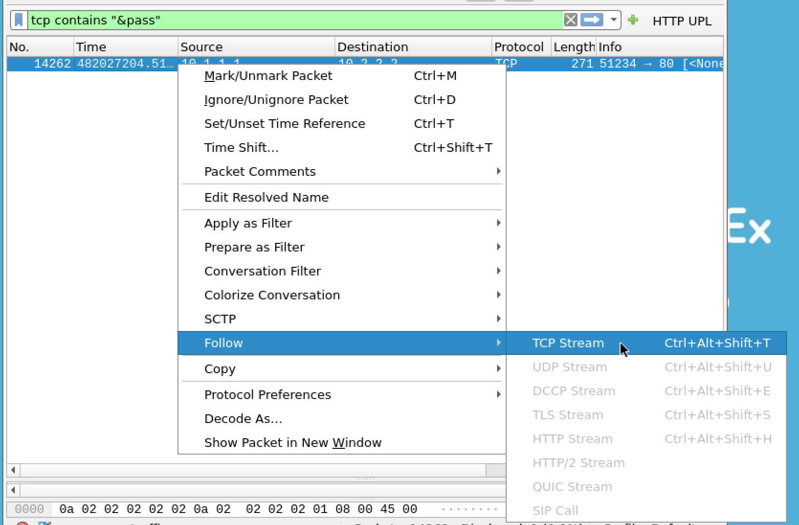
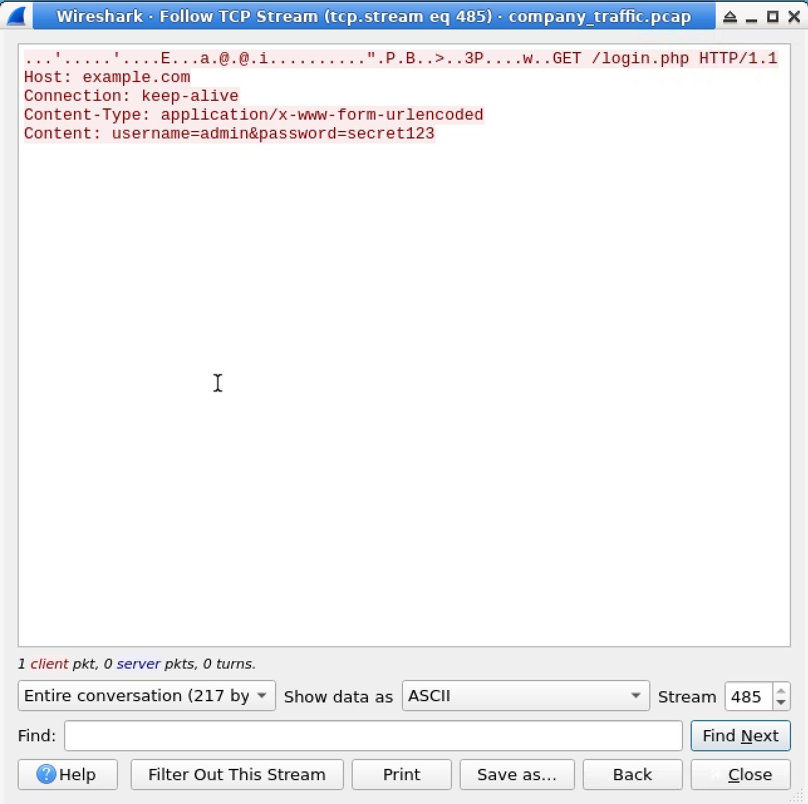
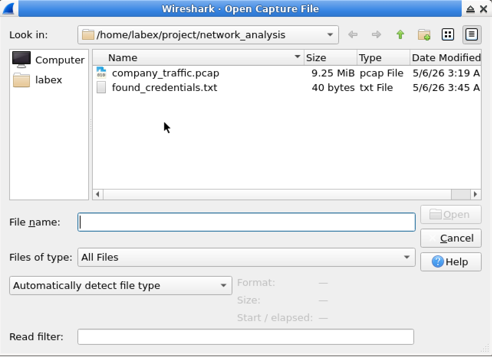
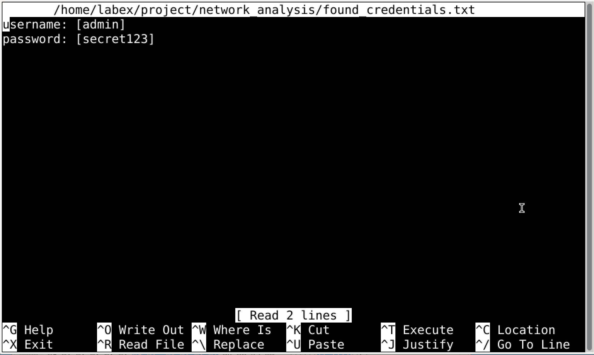

# Lab 03: Find Exposed Login Credentials in Wireshark

## Overview

In this lab, I used Wireshark to analyze a packet capture file and identify login credentials transmitted in clear text.

The purpose of this lab was to practice searching packet contents for credential-related information, following a TCP stream, and documenting exposed credentials found in network traffic.

This lab was completed in a controlled LabEx virtual machine environment.

## Objective

The goal of this lab was to:

- Open a provided packet capture file in Wireshark
- Search packet contents for possible credential data
- Use a Wireshark display filter to find suspicious packets
- Follow a TCP stream to inspect the full conversation
- Identify exposed username and password values
- Save the discovered credentials to a text file
- Understand why transmitting credentials in clear text is dangerous

## Tools Used

- Wireshark
- LabEx virtual machine
- Ubuntu / Linux terminal
- Nano text editor
- Provided packet capture file
- Wireshark display filters

## Scenario

In this lab scenario, a company detected a potential data leak.

As a network security analyst, I needed to analyze recent network traffic and determine whether any user credentials were transmitted in clear text.

The provided packet capture file contained company network traffic. My task was to search for login-related information, inspect packet contents, and document any exposed credentials that I found.

## Lab Environment

The lab was completed inside the LabEx VM.

The provided capture file was located at:

```text
/home/labex/project/network_analysis/company_traffic.pcap
```

The credentials file was saved as:

```text
/home/labex/project/network_analysis/found_credentials.txt
```

For this GitHub portfolio write-up, I do not include the original `.pcap` file. I document the process, filters used, screenshots, results, and what I learned.

## Commands and Filters Used

### 1. Open Wireshark

Wireshark can be started from the terminal with:

```bash
wireshark
```

Then I opened the provided capture file:

```text
/home/labex/project/network_analysis/company_traffic.pcap
```

---

### 2. Search for Possible Password Data

To search for packets containing password-related data, I used this Wireshark display filter:

```wireshark
tcp contains "&pass"
```

This filter searches TCP packet contents for the string:

```text
&pass
```

This helped identify a packet that contained credential-related information.

---

### 3. Follow the TCP Stream

After finding the matching packet, I right-clicked the packet and selected:

```text
Follow > TCP Stream
```

Following the TCP stream allowed me to view the full conversation and inspect the data in a more readable format.

The stream showed clear-text login data:

```text
GET /login.php HTTP/1.1
Host: example.com
Content-Type: application/x-www-form-urlencoded
Content: username=admin&password=secret123
```

---

### 4. Save the Found Credentials

The discovered credentials were saved to:

```text
/home/labex/project/network_analysis/found_credentials.txt
```

The file content was:

```text
username: [admin]
password: [secret123]
```

This can be created with Nano:

```bash
nano /home/labex/project/network_analysis/found_credentials.txt
```

Then enter:

```text
username: [admin]
password: [secret123]
```

Save in Nano:

```text
Ctrl + O
Enter
Ctrl + X
```

## Steps

### Step 1: Open the Packet Capture File

I opened Wireshark and loaded the provided capture file:

```text
/home/labex/project/network_analysis/company_traffic.pcap
```

This file contained captured company network traffic from the time of the suspected data leak.

---

### Step 2: Apply a Credential Search Filter

In the Wireshark display filter bar, I entered:

```wireshark
tcp contains "&pass"
```

This filter displayed a packet that contained possible password-related content.

The matching packet appeared as TCP traffic.

---

### Step 3: Follow the TCP Stream

I right-clicked the matching packet and selected:

```text
Follow > TCP Stream
```

This opened the full TCP conversation.

Following the stream made it easier to read the packet contents and identify the exposed login request.

---

### Step 4: Identify the Exposed Credentials

In the TCP stream, I found the following clear-text credential data:

```text
username=admin&password=secret123
```

From this data, the discovered credentials were:

```text
username: admin
password: secret123
```

This showed that login credentials were transmitted without encryption.

---

### Step 5: Save the Credentials to a File

I saved the credentials in the required file:

```text
/home/labex/project/network_analysis/found_credentials.txt
```

The saved file contained:

```text
username: [admin]
password: [secret123]
```

## Expected Result

The correct filter should reveal a packet containing credential-related data.

Expected discovered data:

```text
username=admin&password=secret123
```

Expected saved file content:

```text
username: [admin]
password: [secret123]
```

## Explanation of the Result

The packet capture contained login credentials transmitted in clear text.

This is a serious security issue because anyone with access to the network traffic could read the username and password.

The discovered data was:

```text
username=admin&password=secret123
```

This means the login information was not protected by encryption.

If sensitive information is sent over unencrypted traffic, attackers may be able to capture it using packet analysis tools such as Wireshark.

## Screenshots

### Credential Filter Result



### Follow TCP Stream



### Exposed Credentials in TCP Stream



### Capture Folder with Results File



### Found Credentials File



## Key Terms

| Term | Meaning |
|---|---|
| Wireshark | A network protocol analyzer used to capture and inspect packets |
| Packet capture | A saved file containing recorded network packets |
| PCAP | A file format used to store captured network traffic |
| Display filter | A Wireshark filter used to show only selected packets |
| Clear text | Data that is readable and not encrypted |
| Credentials | Login information such as username and password |
| TCP stream | A full TCP conversation reconstructed by Wireshark |
| HTTP | Hypertext Transfer Protocol, which can expose data if not encrypted |
| HTTPS | Secure version of HTTP that encrypts web traffic |
| `tcp contains` | A Wireshark filter expression used to search TCP packet contents |
| Data leak | Exposure of sensitive information to unauthorized parties |

## What I Learned

In this lab, I learned how to use Wireshark to search packet contents for exposed login credentials.

I practiced using the `tcp contains` filter to locate suspicious packet data and used the **Follow TCP Stream** feature to inspect the full conversation.

I also learned that credentials transmitted in clear text can be read directly from captured network traffic. This is dangerous because an attacker could steal usernames and passwords if the traffic is not encrypted.

This lab reinforced the importance of using encrypted protocols such as HTTPS when transmitting sensitive information.

## Security Note

This lab was completed in a controlled LabEx educational environment.

The credentials shown in this lab are simulated training data. They should not be used outside the lab environment.

Packet captures should only be opened, captured, or analyzed when permission is given. Capturing or inspecting network traffic without authorization can be illegal and unethical.

## Conclusion

This lab demonstrated how Wireshark can be used to identify exposed login credentials in network traffic.

By applying the filter `tcp contains "&pass"` and following the TCP stream, I was able to locate clear-text credential data and document the discovered username and password.
