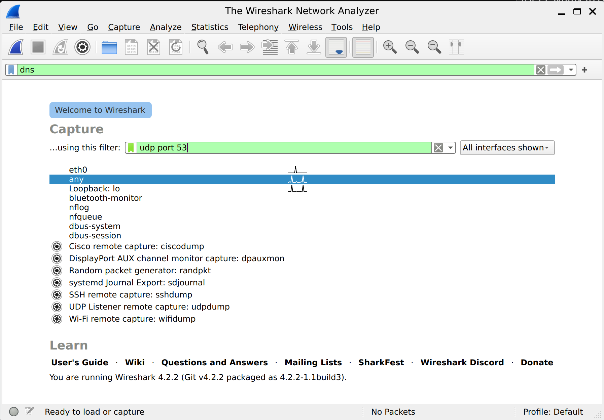
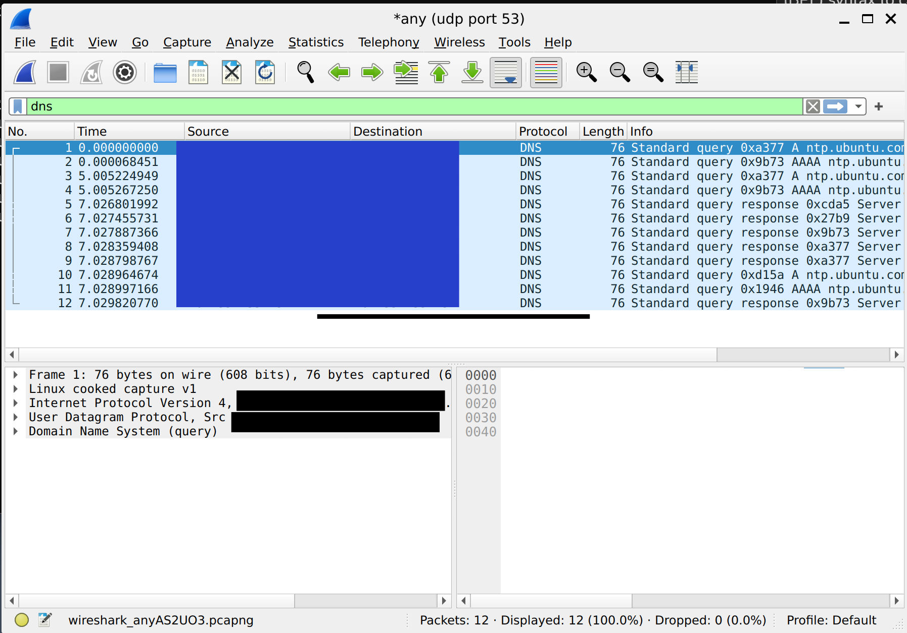
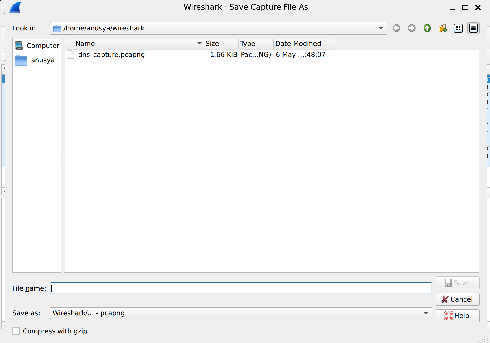

# Lab 04: Filter DNS Communications in Wireshark

## Overview

In this lab, I used Wireshark to capture and filter DNS traffic on my Ubuntu machine.

The purpose of this lab was to practice using a Wireshark capture filter to collect only DNS packets. I used the capture filter `udp port 53`, captured DNS traffic on the `any` interface, verified that only DNS packets were displayed, and saved the capture as a `.pcapng` file.

This lab was completed on my own Ubuntu machine.

## Objective

The goal of this lab was to:

- Launch Wireshark on Ubuntu
- Select the correct network interface
- Apply a capture filter for DNS traffic
- Capture DNS packets using UDP port 53
- Collect at least 10 DNS packets
- Verify that the captured packets are DNS traffic
- Save the packet capture as `dns_capture.pcapng`
- Understand why DNS traffic is important in cybersecurity investigations

## Tools Used

- Wireshark
- Ubuntu Linux
- Linux terminal
- Wireshark capture filters
- Wireshark display filters
- PCAPNG capture file

## Scenario

In this lab scenario, suspicious network activity suggested possible DNS tunneling.

As a network security analyst at CyberDefend Inc., I was tasked with monitoring DNS traffic on the company network. My job was to isolate and capture only DNS communications for further analysis.

DNS traffic is important in cybersecurity because attackers can abuse DNS for command-and-control communication, data exfiltration, and DNS tunneling. Filtering DNS traffic helps analysts focus only on packets that are relevant to the investigation.

## Lab Environment

This lab was completed on my own Ubuntu machine.

The capture was performed in Wireshark using the `any` interface.

The capture file was saved in the following local folder:

```text
/home/anusya/wireshark
```

The capture file was saved locally on my machine as:

```text
dns_capture.pcapng
```

For privacy and security reasons, I do not include the original .pcapng file in this public repository.

## Commands and Filters Used

### Wireshark Capture Filter

To capture only DNS traffic, I used this capture filter before starting the capture:

```wireshark
udp port 53
```

This filter captures UDP packets where the source or destination port is `53`.

DNS usually uses UDP port 53 for domain name queries and responses.

### Wireshark Display Filter

To display DNS packets in Wireshark, I used this display filter:

```wireshark
dns
```

The display filter helped confirm that the captured packets were DNS packets.

## Steps

### Step 1: Launch Wireshark

I opened Wireshark on my Ubuntu machine.

Wireshark displayed the available network interfaces, including:

```text
eth0
any
Loopback: lo
bluetooth-monitor
nflog
nfqueue
dbus-system
dbus-session
```

For this lab, I selected the `any` interface because it can capture traffic from all available interfaces.

---

### Step 2: Configure the DNS Capture Filter

Before starting the capture, I entered the following capture filter in Wireshark:

```wireshark
udp port 53
```

This is a capture filter.

A capture filter controls what packets Wireshark records before the capture begins.

This is different from a display filter. A display filter only controls what packets are shown after traffic has already been captured.

By using `udp port 53`, Wireshark captured only DNS-related UDP traffic.

---

### Step 3: Start the Packet Capture

After selecting the `any` interface and entering the capture filter, I started the capture.

The Wireshark window showed that the active capture was running on:

```text
any (udp port 53)
```

This confirmed that Wireshark was capturing traffic on the `any` interface while using the DNS capture filter.

---

### Step 4: Capture DNS Packets

Wireshark captured DNS query and response packets.

In my capture, Wireshark collected 12 packets.

The packet list showed DNS traffic related to Ubuntu network time queries, including requests for:

```text
ntp.ubuntu.com
```

The Protocol column showed:

```text
DNS
```

The packet details pane showed DNS packet information, including:

```text
User Datagram Protocol
Domain Name System (query)
```

This confirmed that the packets were DNS packets using UDP port 53.

---

### Step 5: Verify the Captured Traffic

I verified the capture by checking the packet list in Wireshark.

The capture showed:

```text
Packets: 12
Displayed: 12 (100.0%)
Dropped: 0 (0.0%)
```

This means Wireshark captured 12 packets, displayed all 12 packets, and dropped no packets.

The visible packets were DNS queries and DNS responses.

---

### Step 6: Save the Capture File

After collecting enough DNS packets, I saved the capture file.

In Wireshark, I used:

```text
File > Save As
```

The file was saved in:

```text
/home/anusya/wireshark
```

The file name was:

```text
dns_capture.pcapng
```

I did not modify the capture file after saving it.

## Expected Result

The correct capture filter should collect only DNS traffic that uses UDP port 53.

Expected capture filter:

```wireshark
udp port 53
```

Expected display filter:

```wireshark
dns
```

Expected saved file:

```text
dns_capture.pcapng
```

Expected packet details:

```text
Protocol: DNS
Port: 53
Traffic type: DNS queries and DNS responses
```

Expected result from my capture:

```text
Packets: 12
Displayed: 12 (100.0%)
Dropped: 0 (0.0%)
```

## Explanation of the Result

The capture filter collected only UDP traffic using port 53.

Port 53 is the standard port used by DNS. DNS stands for Domain Name System. DNS translates domain names into IP addresses.

In this capture, Wireshark showed DNS packets related to `ntp.ubuntu.com`.

Ubuntu systems may contact `ntp.ubuntu.com` to synchronize system time. Before connecting to that service, the system needs to resolve the domain name, so DNS queries are generated.

Because the Wireshark capture filter was set to:

```wireshark
udp port 53
```

Wireshark captured only DNS query and response packets. It ignored unrelated traffic such as normal web browsing, updates, and other background traffic.

This made the capture cleaner and easier to analyze.

## Screenshots

### DNS Capture Filter and Interface Selection



### DNS Packets Captured



### Saved DNS Capture File



## Key Terms

| Term | Meaning |
|---|---|
| Wireshark | A network protocol analyzer used to capture and inspect packets |
| DNS | Domain Name System, which translates domain names into IP addresses |
| UDP | User Datagram Protocol, a fast transport protocol commonly used by DNS |
| TCP | Transmission Control Protocol, a reliable transport protocol that DNS can sometimes use |
| Port 53 | The standard network port used for DNS traffic |
| Capture filter | A Wireshark filter used before capturing packets to decide what traffic is recorded |
| Display filter | A Wireshark filter used after capturing packets to decide what traffic is shown |
| BPF | Berkeley Packet Filter, the syntax used for many capture filters |
| Packet | A small unit of data sent across a network |
| PCAPNG | A packet capture file format used by Wireshark |
| DNS query | A request asking for information about a domain name |
| DNS response | A reply from a DNS server with information such as an IP address |
| DNS tunneling | A technique attackers may use to hide data or commands inside DNS traffic |
| Interface | A network connection that Wireshark can capture traffic from |
| `any` interface | A Linux capture option that can capture traffic from all interfaces |

## What I Learned

In this lab, I learned how to use Wireshark to capture only DNS traffic with a capture filter.

I practiced applying the filter:

```wireshark
udp port 53
```

before starting the capture. This helped me collect only DNS packets instead of capturing all network traffic.

I also learned how to use the Wireshark display filter:

```wireshark
dns
```

to confirm that the captured packets were DNS packets.

This lab helped me understand the difference between a capture filter and a display filter. A capture filter controls what Wireshark records, while a display filter controls what Wireshark shows after traffic has already been captured.

I also learned why DNS traffic is important in cybersecurity. Attackers may abuse DNS for tunneling, command-and-control communication, or data exfiltration. Capturing and reviewing DNS packets can help analysts investigate suspicious network behavior.

## Security Note

This lab was completed on my own Ubuntu machine in a controlled educational environment.

The DNS traffic captured in this lab was normal system traffic, including DNS queries related to Ubuntu services such as `ntp.ubuntu.com`.

Packet captures should only be created or analyzed on networks where permission is given. Capturing traffic without authorization can be illegal and unethical.

## Conclusion

This lab demonstrated how Wireshark can be used to isolate DNS communications from other network traffic.

By applying the capture filter:

```wireshark
udp port 53
```

I captured DNS query and response packets only.

I used the `any` interface, captured 12 DNS packets, verified that all displayed packets were DNS traffic, and saved the result as:

```text
dns_capture.pcapng
```

This exercise showed how capture filters help cybersecurity analysts focus on specific traffic during network investigations.
