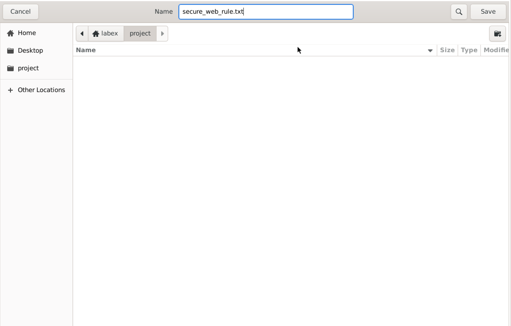
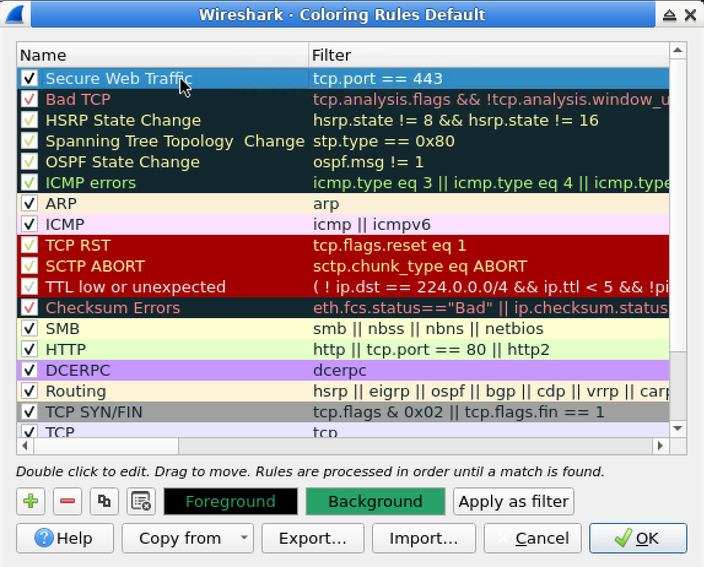
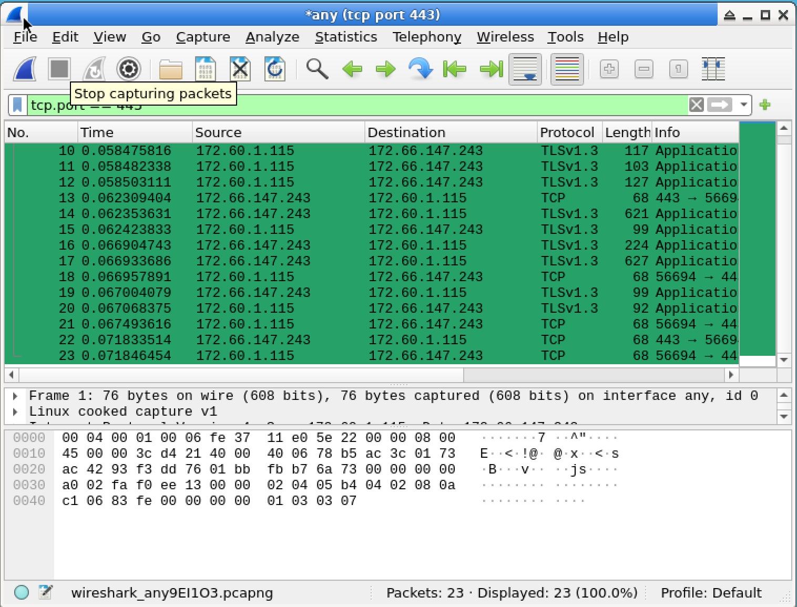

# Lab 05: Create HTTPS Traffic Detector in Wireshark

## Overview

In this lab, I created a custom Wireshark coloring rule to highlight HTTPS traffic.

The purpose of this lab was to practice using Wireshark Coloring Rules to make encrypted web traffic easier to identify during packet analysis. I created a rule named `Secure Web Traffic` that highlights HTTPS traffic using the filter expression `tcp.port == 443`.

This lab was completed in a controlled LabEx virtual machine environment.

## Objective

The goal of this lab was to:

- Launch Wireshark
- Open the Coloring Rules menu
- Create a new custom coloring rule
- Name the rule `Secure Web Traffic`
- Use the filter expression `tcp.port == 443`
- Set the background color to green
- Set the foreground text color to black
- Enable the new coloring rule
- Capture or display HTTPS traffic
- Export the coloring rule to a file
- Save the exported rule as `secure_web_rule.txt`
- Understand how coloring rules help with packet analysis

## Tools Used

- Wireshark
- LabEx virtual machine
- Ubuntu / Linux terminal
- Wireshark Coloring Rules
- HTTPS traffic filter
- TCP port 443

## Scenario

In this lab scenario, I took on the role of a junior cybersecurity analyst at SecureNet.

I was tasked with monitoring encrypted web traffic on the organization's network. My supervisor wanted HTTPS connections to be easy to identify during packet analysis.

To complete this task, I created a custom Wireshark coloring rule that highlights HTTPS traffic with a green background and black text.

## Lab Environment

The lab was completed inside the LabEx VM.

The exported coloring rule file was saved as:

```text
/home/labex/project/secure_web_rule.txt
```

The custom coloring rule used the following filter expression:

```wireshark
tcp.port == 443
```

For this GitHub portfolio write-up, I include the lab process, rule configuration, screenshots, result, and what I learned.

## Commands and Filters Used

### 1. Open Wireshark

Wireshark can be started from the terminal with:

```bash
wireshark
```

Wireshark can also be opened from the application menu.

---

### 2. HTTPS Traffic Filter

The filter expression used for the coloring rule was:

```wireshark
tcp.port == 443
```

This filter matches TCP traffic where the source or destination port is `443`.

Port 443 is commonly used for HTTPS traffic.

---

### 3. Coloring Rule Name

The custom rule was named:

```text
Secure Web Traffic
```

---

### 4. Exported Rule File

The coloring rule was exported and saved as:

```text
/home/labex/project/secure_web_rule.txt
```

## Steps

### Step 1: Launch Wireshark

I launched Wireshark from the terminal using:

```bash
wireshark
```

Wireshark opened and displayed the main interface.

---

### Step 2: Open Coloring Rules

In Wireshark, I opened the Coloring Rules window from the menu:

```text
View > Coloring Rules
```

The Coloring Rules window allows users to create rules that visually highlight packets matching specific filter expressions.

---

### Step 3: Create a New Coloring Rule

In the Coloring Rules window, I clicked the `+` button to add a new rule.

This created a new coloring rule entry.

---

### Step 4: Configure the Rule Name

I named the new rule:

```text
Secure Web Traffic
```

This name describes the purpose of the rule: identifying secure web traffic.

---

### Step 5: Configure the Filter Expression

For the filter expression, I entered:

```wireshark
tcp.port == 443
```

This expression matches HTTPS traffic because HTTPS normally uses TCP port 443.

The rule applies to packets where either the source port or destination port is 443.

---

### Step 6: Set the Background Color

I set the background color to:

```text
Green
```

This makes HTTPS packets stand out in the packet list.

---

### Step 7: Set the Text Color

I set the foreground text color to:

```text
Black
```

Black text on a green background makes the highlighted packets easier to read.

---

### Step 8: Enable the Coloring Rule

I enabled the new coloring rule by checking the checkbox next to the rule.

This step is important because the rule will not apply unless it is enabled.

---

### Step 9: Apply the Rule

After configuring the rule, I applied the changes.

The rule appeared at the top of the Coloring Rules list with the name:

```text
Secure Web Traffic
```

and the filter:

```wireshark
tcp.port == 443
```

The rule used a green background and black foreground text.

---

### Step 10: Capture HTTPS Traffic

After applying the rule, HTTPS traffic using TCP port 443 was highlighted in Wireshark.

The capture used the interface:

```text
any
```

The capture filter shown in Wireshark was:

```wireshark
tcp port 443
```

The highlighted packets showed traffic using TLS and TCP, which is commonly related to encrypted HTTPS communication.

The packet list showed:

```text
Packets: 23
Displayed: 23 (100.0%)
```

This confirmed that the filtered HTTPS traffic was displayed and highlighted.

---

### Step 11: Export the Coloring Rule

After creating and enabling the rule, I exported the coloring rule.

The exported file was saved as:

```text
secure_web_rule.txt
```

The file was saved in the project directory:

```text
/home/labex/project
```

## Expected Result

The custom coloring rule should appear in Wireshark Coloring Rules.

Expected rule name:

```text
Secure Web Traffic
```

Expected filter expression:

```wireshark
tcp.port == 443
```

Expected colors:

```text
Background color: Green
Foreground text color: Black
```

Expected exported file:

```text
/home/labex/project/secure_web_rule.txt
```

Expected Wireshark result:

```text
HTTPS traffic using TCP port 443 is highlighted with a green background and black text.
```

## Explanation of the Result

The coloring rule uses the filter expression:

```wireshark
tcp.port == 443
```

This expression matches packets that use TCP port 443.

TCP port 443 is the standard port used by HTTPS. HTTPS stands for Hypertext Transfer Protocol Secure. It is the encrypted version of HTTP and is commonly used for secure websites.

In Wireshark, HTTPS traffic may appear as TLS traffic because TLS is the encryption protocol used to secure HTTPS connections.

By creating a coloring rule for TCP port 443, Wireshark visually highlights HTTPS-related traffic in the packet list.

This helps analysts quickly identify secure web connections without manually checking each packet.

The green background and black text make the packets easier to see during traffic analysis.

## Screenshots

### Saved Secure Web Rule File



### Secure Web Traffic Coloring Rule



### HTTPS Traffic Highlighted



## Key Terms

| Term | Meaning |
|---|---|
| Wireshark | A network protocol analyzer used to capture and inspect packets |
| Coloring rule | A Wireshark rule that changes packet colors when packets match a filter |
| HTTPS | Hypertext Transfer Protocol Secure, the encrypted version of HTTP |
| HTTP | Hypertext Transfer Protocol, used for web communication |
| TLS | Transport Layer Security, the encryption protocol commonly used by HTTPS |
| TCP | Transmission Control Protocol, a reliable transport protocol |
| Port 443 | The standard TCP port used for HTTPS traffic |
| Filter expression | A Wireshark expression used to match specific packets |
| `tcp.port == 443` | A Wireshark filter that matches TCP traffic using port 443 |
| `tcp port 443` | A Wireshark capture filter that captures TCP traffic on port 443 |
| Background color | The color behind the packet row in Wireshark |
| Foreground color | The text color of the packet row in Wireshark |
| Encrypted traffic | Network traffic that is protected so the contents cannot be easily read |
| Packet analysis | The process of inspecting network packets to understand communication |
| Export | Saving configuration or data to a file |
| Secure web traffic | Web traffic protected by encryption, usually HTTPS |

## What I Learned

In this lab, I learned how to create a custom coloring rule in Wireshark.

I practiced opening the Coloring Rules window, adding a new rule, naming the rule, entering a filter expression, choosing colors, enabling the rule, and exporting the rule to a file.

I learned that the filter expression:

```wireshark
tcp.port == 443
```

can be used to identify HTTPS traffic because HTTPS normally uses TCP port 443.

I also learned that HTTPS traffic may appear as TLS traffic in Wireshark because TLS provides encryption for HTTPS connections.

This lab showed me that coloring rules are useful during packet analysis because they make important traffic easier to identify visually.

This is helpful for cybersecurity analysts because it allows them to quickly notice specific types of traffic, such as encrypted web connections, during network monitoring.

## Security Note

This lab was completed in a controlled LabEx educational environment.

The coloring rule created in this lab is safe because it only changes how packets are displayed in Wireshark. It does not change network traffic or modify captured packets.

Packet captures and traffic analysis should only be performed on systems and networks where permission is given.

For this public GitHub portfolio write-up, I include screenshots and documentation only. I do not include unnecessary packet capture files.

## Conclusion

This lab demonstrated how Wireshark coloring rules can help identify important network traffic.

By creating a rule named:

```text
Secure Web Traffic
```

with the filter expression:

```wireshark
tcp.port == 443
```

I was able to highlight HTTPS traffic with a green background and black text.

I also exported the coloring rule as:

```text
secure_web_rule.txt
```

This exercise showed how visual packet highlighting can help cybersecurity analysts quickly recognize secure web connections during network monitoring and packet analysis.
