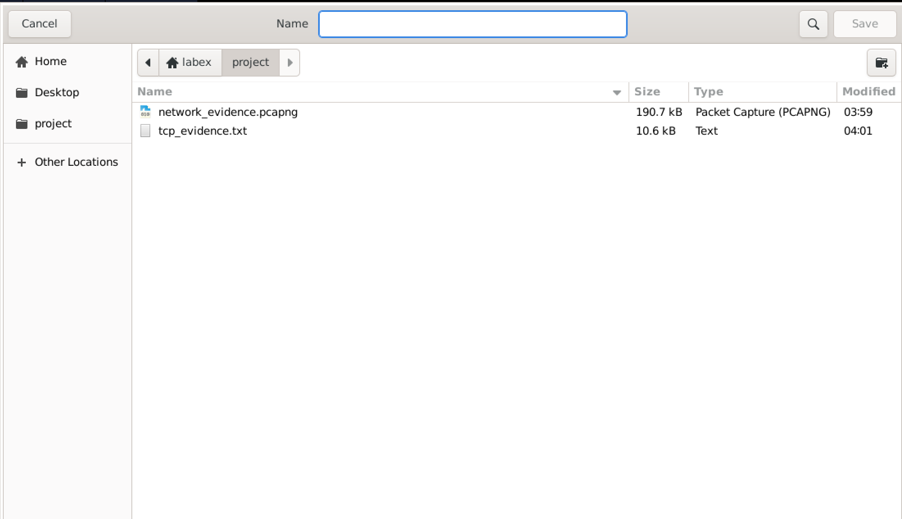
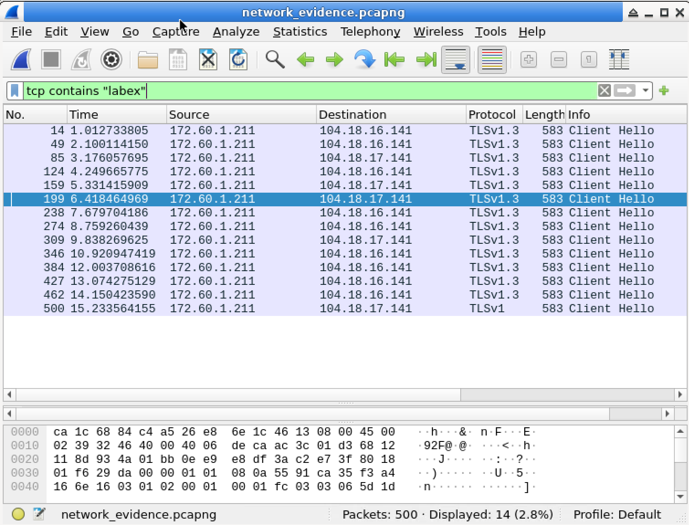

# Lab 06: Extract Web Traffic Evidence in Wireshark

## Overview

In this lab, I used Wireshark to extract web traffic evidence from a packet capture file.

The purpose of this lab was to practice network forensic analysis by filtering captured packets, searching packet contents for specific text, identifying communication related to `labex.io`, following a TCP stream, and saving the extracted communication evidence as a text file.

This lab was completed in a controlled LabEx virtual machine environment.

## Objective

The goal of this lab was to:

- Open a provided packet capture file in Wireshark
- Use a display filter to search TCP packet contents
- Filter TCP packets containing the text `labex`
- Identify communication related to `labex.io`
- Follow a TCP stream from the filtered packets
- View the full TCP conversation
- Save the TCP stream content as `tcp_evidence.txt`
- Understand how packet captures can be used as forensic evidence
- Practice documenting suspicious web communication

## Tools Used

- Wireshark
- LabEx virtual machine
- Ubuntu / Linux terminal
- Provided packet capture file
- Wireshark display filters
- Follow TCP Stream
- Text evidence file

## Scenario

In this lab scenario, I took on the role of a cybersecurity trainee at NetDefenders.

I was investigating a potential data leak. My instructor provided a network traffic capture file and asked me to extract communication evidence between an employee system and `labex.io`.

To complete the investigation, I used Wireshark to filter captured traffic, find TCP packets containing `labex`, follow the TCP stream, and save the complete stream data as evidence.

## Lab Environment

The lab was completed inside the LabEx VM.

The provided capture file was:

```text
network_evidence.pcapng
```

The evidence file was saved as:

```text
/home/labex/project/tcp_evidence.txt
```

The project directory contained:

```text
network_evidence.pcapng
tcp_evidence.txt
```

For this GitHub portfolio write-up, I include the lab process, filters used, screenshots, results, and what I learned.

I do not include the original packet capture file in this public repository.

## Commands and Filters Used

### 1. Open Wireshark

Wireshark can be started from the terminal with:

```bash
wireshark
```

Wireshark can also be opened from the application menu.

---

### 2. Open the Packet Capture File

The provided packet capture file was opened in Wireshark:

```text
network_evidence.pcapng
```

This file contained captured network traffic for the investigation.

---

### 3. Display Filter for TCP Packets Containing Text

To find TCP packets containing the text `labex`, I used this Wireshark display filter:

```wireshark
tcp contains "labex"
```

This filter searches TCP packet contents for the text string `labex`.

---

### 4. Follow TCP Stream

After finding a matching packet, I used:

```text
Follow > TCP Stream
```

This allowed me to view the full TCP conversation in one readable window.

---

### 5. Save the TCP Stream Evidence

The TCP stream content was saved as:

```text
tcp_evidence.txt
```

The required save location was:

```text
/home/labex/project/tcp_evidence.txt
```

## Steps

### Step 1: Open the Capture File

I opened Wireshark and loaded the provided packet capture file:

```text
network_evidence.pcapng
```

This file contained captured network traffic related to the investigation.

The file was located in the LabEx project directory.

---

### Step 2: Apply the Display Filter

In the Wireshark display filter bar, I entered:

```wireshark
tcp contains "labex"
```

This filter displayed TCP packets that contained the text `labex` in their packet contents.

This helped isolate traffic related to `labex.io`.

---

### Step 3: Review the Filtered Packets

After applying the filter, Wireshark displayed matching packets.

The capture showed:

```text
Packets: 500
Displayed: 14 (2.8%)
```

This means the original capture contained 500 packets, and 14 packets matched the display filter.

The filtered packets appeared as TLS traffic and showed `Client Hello` messages.

This indicated that the communication was related to encrypted web traffic.

---

### Step 4: Select a Filtered Packet

I selected one of the filtered packets that matched the search.

The selected packet contained evidence of communication involving `labex`.

---

### Step 5: Follow the TCP Stream

I right-clicked the selected packet and chose:

```text
Follow > TCP Stream
```

The Follow TCP Stream feature reconstructed the full TCP conversation.

This made it easier to view the communication as a complete conversation instead of reading individual packets one by one.

---

### Step 6: Review the TCP Stream Content

In the TCP stream window, I reviewed the conversation data.

The stream showed communication evidence involving:

```text
labex.io
```

The content could include TLS handshake information and encrypted HTTPS traffic metadata.

Even when HTTPS traffic is encrypted, metadata and stream structure can still help analysts understand communication patterns.

---

### Step 7: Save the TCP Stream

In the Follow TCP Stream window, I used the save option to export the stream content.

The file was saved as:

```text
tcp_evidence.txt
```

The file was saved in:

```text
/home/labex/project
```

The full required path was:

```text
/home/labex/project/tcp_evidence.txt
```

---

### Step 8: Verify the Evidence File

After saving the stream, I verified that the evidence file existed in the project directory.

The project directory contained:

```text
network_evidence.pcapng
tcp_evidence.txt
```

The saved file size was shown as:

```text
10.6 kB
```

This confirmed that the TCP stream evidence was saved successfully.

## Expected Result

The correct display filter should show TCP packets containing the text `labex`.

Expected display filter:

```wireshark
tcp contains "labex"
```

Expected domain or text found:

```text
labex
labex.io
```

Expected action:

```text
Follow > TCP Stream
```

Expected saved file:

```text
/home/labex/project/tcp_evidence.txt
```

Expected result:

```text
The TCP stream content is saved as evidence in tcp_evidence.txt.
```

In my lab, the capture showed:

```text
Packets: 500
Displayed: 14 (2.8%)
```

The project folder showed:

```text
network_evidence.pcapng
tcp_evidence.txt
```

## Explanation of the Result

The display filter:

```wireshark
tcp contains "labex"
```

searches inside TCP packet contents for the text `labex`.

This is useful during network forensic investigations because analysts often need to search traffic for specific domains, usernames, filenames, commands, or other indicators.

After locating a matching packet, I followed the TCP stream to reconstruct the full conversation.

A TCP stream is a complete communication session between two endpoints. Instead of viewing separate packets, following the stream allows an analyst to see the conversation in order.

The filtered traffic appeared as TLS traffic with `Client Hello` messages. TLS is commonly used to encrypt HTTPS communication. Even though encrypted traffic does not reveal all content, it can still show useful metadata and communication patterns.

Saving the TCP stream as `tcp_evidence.txt` creates a separate evidence file that can be used in a forensic report.

## Screenshots

### Project Folder with Evidence Files



### TCP Contains Labex Filter



### Follow TCP Stream


### TCP Stream Conversation


### Saved TCP Evidence File


## Key Terms

| Term | Meaning |
|---|---|
| Wireshark | A network protocol analyzer used to capture and inspect packets |
| Packet capture | A file containing recorded network packets |
| PCAPNG | A packet capture file format used by Wireshark |
| TCP | Transmission Control Protocol, a reliable transport protocol |
| TCP stream | A full TCP conversation reconstructed by Wireshark |
| Display filter | A Wireshark filter used after packets are captured to show selected traffic |
| `tcp contains` | A Wireshark filter expression used to search TCP packet contents |
| TLS | Transport Layer Security, encryption commonly used by HTTPS |
| HTTPS | Hypertext Transfer Protocol Secure, encrypted web traffic |
| Client Hello | A TLS handshake message sent by a client when starting a secure connection |
| Evidence file | A saved file that contains information collected during an investigation |
| Network forensics | The process of collecting and analyzing network data for investigation |
| Data leak | Unauthorized or suspicious exposure of information |
| `labex.io` | The domain investigated in this lab scenario |
| Metadata | Information about communication, such as endpoints, ports, timing, and protocol details |

## What I Learned

In this lab, I learned how to use Wireshark for basic network forensic analysis.

I practiced applying the display filter:

```wireshark
tcp contains "labex"
```

to find TCP packets containing specific text.

I also learned how to use the Follow TCP Stream feature to reconstruct a full conversation from filtered packets.

This lab helped me understand how Wireshark can be used to find and save useful traffic evidence from a packet capture.

I learned that TLS traffic may not show readable web content because it is encrypted, but it can still reveal useful metadata, such as connection behavior and traffic patterns.

This exercise showed me how packet filtering and saving TCP stream data can help during a basic network investigation.

## Security Note

This lab was completed in a controlled LabEx educational environment.

The packet capture file and evidence data were provided for training purposes only.

For this public GitHub portfolio write-up, I do not include the original packet capture file. I only include documentation and screenshots.

Packet captures should only be opened, captured, or analyzed when permission is given. Capturing or inspecting network traffic without authorization can be illegal and unethical.

## Conclusion

This lab demonstrated how Wireshark can be used to extract web traffic evidence from a packet capture file.

By applying the display filter:

```wireshark
tcp contains "labex"
```

and using:

```text
Follow > TCP Stream
```

I practiced viewing the TCP stream and saving the evidence file as:

```text
tcp_evidence.txt
```

This exercise showed how Wireshark can help beginners practice finding, following, and saving network traffic evidence.
