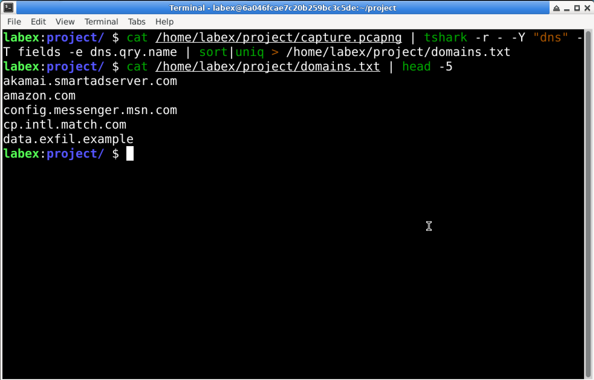

# Lab 07: Uncover Suspicious DNS Queries with TShark

## Overview

In this lab, I used `tshark` to extract DNS query names from a packet capture file.

The purpose of this lab was to practice command-line packet analysis by filtering DNS traffic, extracting DNS query names, sorting the results alphabetically, removing duplicate entries, and saving the final list to a text file.

This lab was completed in a controlled LabEx virtual machine environment.

## Objective

The goal of this lab was to:

- Use `tshark` to analyze a packet capture file
- Filter the capture file to show only DNS traffic
- Extract DNS query names from the capture
- Sort the extracted domain names alphabetically
- Remove duplicate domain names
- Save the final list to `domains.txt`
- Practice using Linux command pipelines
- Understand how DNS query analysis can help during security investigations

## Tools Used

- LabEx virtual machine
- Ubuntu / Linux terminal
- `tshark`
- Packet capture file
- DNS traffic
- Linux pipes
- `sort`
- `uniq`
- `head`
- `cat`

## Scenario

In this lab scenario, I investigated possible data exfiltration through DNS queries.

As a cybersecurity analyst, I needed to analyze a network traffic capture file and identify domain names that were queried. These domain names could help reveal suspicious communication or possible command-and-control activity.

To complete the task, I used `tshark`, the command-line version of Wireshark, to extract DNS query names from the capture file and save the results for analysis.

## Lab Environment

The lab was completed inside the LabEx VM.

The provided packet capture file was located at:

```text
/home/labex/project/capture.pcapng
```

The final output file was saved as:

```text
/home/labex/project/domains.txt
```

For this GitHub portfolio write-up, I include the lab process, command used, screenshot, result, and what I learned.

I do not include the original packet capture file in this public repository.

## Commands Used

### Extract DNS Query Names

The command used in this lab was:

```bash
cat /home/labex/project/capture.pcapng | tshark -r - -Y "dns" -T fields -e dns.qry.name | sort | uniq > /home/labex/project/domains.txt
```

This command reads the packet capture file, filters DNS packets, extracts DNS query names, sorts the output, removes duplicates, and saves the final result to `domains.txt`.

### View the First Five Results

To verify the output file, I used:

```bash
cat /home/labex/project/domains.txt | head -5
```

This showed the first five extracted domain names.

## Command Breakdown

### `cat /home/labex/project/capture.pcapng`

```bash
cat /home/labex/project/capture.pcapng
```

The `cat` command outputs the contents of the capture file.

In this lab, the output was passed into `tshark` through a pipe.

---

### `|`

```bash
|
```

The pipe symbol sends the output of one command into the next command.

This allowed the capture file data to be sent directly into `tshark`.

---

### `tshark`

```bash
tshark
```

`tshark` is the command-line version of Wireshark. It allows packet captures to be analyzed directly from the terminal.

---

### `-r -`

```bash
-r -
```

The `-r` option tells `tshark` to read packets from input.

The dash `-` means that `tshark` reads the capture data from standard input instead of reading directly from a file path.

---

### `-Y "dns"`

```bash
-Y "dns"
```

The `-Y` option applies a display filter.

In this lab, the display filter `dns` was used to focus only on DNS packets.

---

### `-T fields`

```bash
-T fields
```

The `-T fields` option tells `tshark` to output only specific packet fields instead of full packet details.

---

### `-e dns.qry.name`

```bash
-e dns.qry.name
```

The `-e dns.qry.name` option extracts only the DNS query name field.

This field contains the domain name requested in a DNS query.

---

### `sort`

```bash
sort
```

The `sort` command sorts the extracted domain names alphabetically.

---

### `uniq`

```bash
uniq
```

The `uniq` command removes duplicate lines.

Because `uniq` works best on sorted input, it is used after `sort`.

---

### `> /home/labex/project/domains.txt`

```bash
> /home/labex/project/domains.txt
```

The `>` symbol redirects the final output into a file.

In this lab, the final list of unique domain names was saved to:

```text
/home/labex/project/domains.txt
```

---

### `head -5`

```bash
head -5
```

The `head -5` command shows the first five lines of a file or command output.

I used it to quickly check the first five domain names saved in `domains.txt`.

## Steps

### Step 1: Open the Terminal

I opened the terminal in the LabEx VM.

The packet capture file was already provided in the project directory.

---

### Step 2: Run the TShark Pipeline

I ran the following command:

```bash
cat /home/labex/project/capture.pcapng | tshark -r - -Y "dns" -T fields -e dns.qry.name | sort | uniq > /home/labex/project/domains.txt
```

This single command pipeline completed all required actions:

```text
Read the capture file
Filter DNS traffic
Extract DNS query names
Sort the results
Remove duplicates
Save the final output
```

---

### Step 3: Verify the Output

After creating the output file, I checked the first five results with:

```bash
cat /home/labex/project/domains.txt | head -5
```

The output showed:

```text
akamai.smartadserver.com
amazon.com
config.messenger.msn.com
cp.intl.match.com
data.exfil.example
```

This confirmed that DNS query names were extracted and saved successfully.

## Expected Result

The command should create a file named:

```text
domains.txt
```

The file should be saved in:

```text
/home/labex/project
```

The final file should contain DNS query names that are:

```text
Extracted from the capture file
Sorted alphabetically
Deduplicated
Saved one domain per line
```

Example output from this lab:

```text
akamai.smartadserver.com
amazon.com
config.messenger.msn.com
cp.intl.match.com
data.exfil.example
```

## Explanation of the Result

The command used `tshark` to analyze DNS traffic from the packet capture file.

The display filter:

```wireshark
dns
```

limited the results to DNS packets.

The field extraction option:

```bash
-T fields -e dns.qry.name
```

extracted only DNS query names from those packets.

Then the command pipeline:

```bash
sort | uniq
```

sorted the domain names alphabetically and removed duplicate entries.

Finally, the output was redirected into:

```text
/home/labex/project/domains.txt
```

The first five results included:

```text
akamai.smartadserver.com
amazon.com
config.messenger.msn.com
cp.intl.match.com
data.exfil.example
```

The domain `data.exfil.example` looks suspicious in the lab scenario because the name suggests possible data exfiltration activity.

## Screenshot

### TShark DNS Query Extraction



## Key Terms

| Term | Meaning |
|---|---|
| TShark | The command-line version of Wireshark used to analyze packet captures |
| Wireshark | A network protocol analyzer used to capture and inspect packets |
| DNS | Domain Name System, which translates domain names into IP addresses |
| DNS query | A request asking for information about a domain name |
| DNS query name | The domain name requested in a DNS query |
| PCAPNG | A packet capture file format used by Wireshark |
| Display filter | A filter used to show only selected packets |
| `-r -` | A TShark option used to read packet data from standard input |
| `-Y` | A TShark option used to apply a display filter |
| `-T fields` | A TShark option used to output specific packet fields |
| `-e dns.qry.name` | A TShark option used to extract DNS query names |
| Pipe `|` | A Linux symbol used to send output from one command into another command |
| `sort` | A Linux command used to sort lines alphabetically |
| `uniq` | A Linux command used to remove duplicate lines |
| `head` | A Linux command used to show the first lines of output |
| Output redirection `>` | A Linux symbol used to save command output to a file |
| Data exfiltration | Unauthorized movement of data out of a system or network |
| Command and control | Communication between malware and an attacker-controlled server |

## What I Learned

In this lab, I learned how to use `tshark` to analyze a packet capture file from the command line.

I practiced using a display filter to focus only on DNS packets:

```bash
-Y "dns"
```

I also practiced extracting a specific packet field:

```bash
-T fields -e dns.qry.name
```

This helped me collect only the DNS query names instead of viewing full packet details.

I learned how Linux commands can be chained together with pipes. I used:

```bash
sort | uniq
```

to sort the domain names and remove duplicate entries.

This lab helped me understand how DNS query analysis can support basic security investigations. Reviewing queried domain names can help identify unusual domains or suspicious communication.

## Security Note

This lab was completed in a controlled LabEx educational environment.

The packet capture file was provided for training purposes only.

For this public GitHub portfolio write-up, I do not include the original packet capture file. I only include documentation and a screenshot.

Packet captures should only be opened, captured, or analyzed when permission is given. Capturing or inspecting network traffic without authorization can be illegal and unethical.

## Conclusion

This lab demonstrated how `tshark` can be used to extract DNS query names from a packet capture file.

By running:

```bash
cat /home/labex/project/capture.pcapng | tshark -r - -Y "dns" -T fields -e dns.qry.name | sort | uniq > /home/labex/project/domains.txt
```

I practiced filtering DNS traffic, extracting domain names, sorting the results, removing duplicates, and saving the final output as:

```text
domains.txt
```

This exercise helped me practice basic command-line packet analysis and showed how DNS query lists can be useful during cybersecurity investigations.
